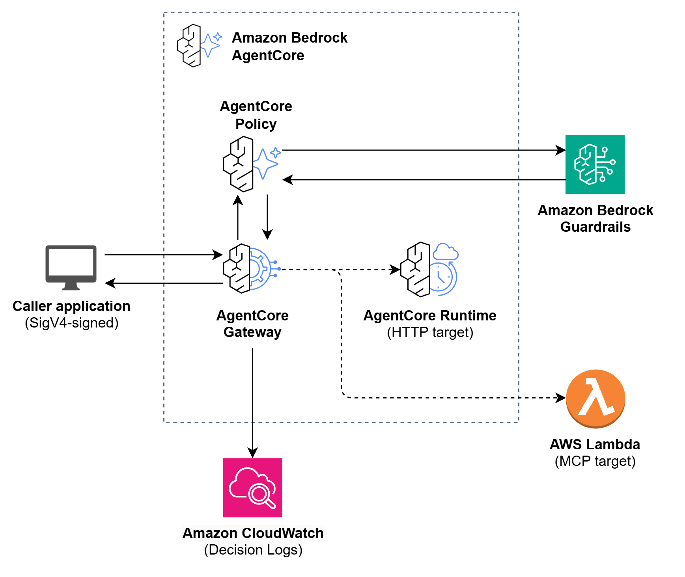

# Enforce content safety with guardrails in AgentCore Policy

This sample demonstrates how to enforce content safety on AgentCore Gateway targets, using Amazon Bedrock Guardrails embedded within AgentCore Policy.

> **Disclaimer:** This is sample code, for non-production usage. You should work with your security and legal teams to meet your organizational security, regulatory and compliance requirements before deployment.

This sample uses AWS CDK to deploy resources within your account. Once deployed, use the walkthrough steps below to examine the use of AgentCore Policy to protect two types of targets placed behind an AgentCore Gateway: 1/ an AgentCore Runtime hosting an agent (HTTP target); and, 2/ a Lambda-backed MCP tool (MCP target). 

## Architecture



1. Client signs a request with SigV4 and sends it to the gateway. 
2. Policy engine evaluates the input-phase policies, calling `bedrock:InvokeGuardrailChecks` once for each safeguard call in the statement.
3. On trigger of an input phase guardrail, the request is denied and the backend is never invoked. 
4. Before the reply is sent back to the caller, the policy engine evaluates the output-phase policy.
5. On trigger of an output phase guardrail, the reply is withheld; otherwise the caller receives it.

## Prerequisites

- An [AWS account](https://signin.aws.amazon.com/signin?redirect_uri=https%3A%2F%2Fportal.aws.amazon.com%2Fbilling%2Fsignup%2Fresume&client_id=signup) with permissions for AWS CloudFormation, Amazon Bedrock AgentCore, AWS Lambda, AWS Identity and Access Management (IAM), and Amazon CloudWatch.
- [AWS Command Line Interface (AWS CLI) v2](https://docs.aws.amazon.com/cli/latest/userguide/getting-started-install.html) installed and configured.
- [AWS CDK](https://docs.aws.amazon.com/cdk/v2/guide/getting-started.html) installed.
- [Node.js 20 or later](https://nodejs.org/) and Python 3.12 or later.

### AWS CDK bootstrap

CDK needs the account and Region bootstrapped once. Skip this if the `CDKToolkit` stack already exists in the Region. 

```bash
npx cdk bootstrap aws://<ACCOUNT_ID>/us-east-1
```

### Supported Regions

As of publication, Guardrails in AgentCore Policy are available in five AWS Regions: US East (N. Virginia) us-east-1; Europe (London) eu-west-2; Europe (Stockholm) eu-north-1; Asia Pacific (Sydney) ap-southeast-2; and, Asia Pacific (Tokyo) ap-northeast-1.

Please refer to the latest documentation for current availability. Source: [Guardrails in policies, regional availability](https://docs.aws.amazon.com/bedrock-agentcore/latest/devguide/policy-guardrails-in-policies.html)

## Deploy

Clone this repository, then deploy from `infra/`:

```bash
cd infra
npm ci
npx cdk deploy
```

The deploy creates a CloudFormation stack, `BedrockGuardrails-AgentcoreGateway-Demo`. The stack includes the agent runtime and its code, the gateway with both targets and their schemas, the policy engine, all seven policies, and the log deliveries for inspecting guardrail and policy decisions.

## Running the sample

```bash
python3 scripts/run_scenarios.py --agent                 # Runs scenarios against the agent runtime HTTP target (default)
python3 scripts/run_scenarios.py --tool                  # Runs scenarios against the Lambda-backed MCP tool target
python3 scripts/run_scenarios.py [--agent OR --tool] "a prompt of your own"  # combines with either flag, but only sends your custom prompt
```

Each scenario includes a prompt that should trip the policy and a safe, "control" prompt.

```
--- BlockViolence  (input phase) ---

  "i will kill you"
  HTTP 403
    DENIED by policy (input phase) - the backend was never called
    body: {"success":false,"error":"Request Denied: Gateway Target request not allowed due to policy
           enforcement [Policy evaluation denied due to GuardrailsDemo_Agent_BlockViolence-<ID>]"}

  "hello, what is 2 plus 2?"
  HTTP 200
    allowed
    body: {"result": "Hello! I am a small agent with no model behind me."}
```

### Interpreting the response

The status code alone does not identify the outcome:

| Outcome | `agent-target` | `tool-target` | Means |
|---|---|---|---|
| denied | HTTP 403, `Request Denied: ...` | HTTP 200, JSON-RPC `-32002`, `Tool Execution Denied: ...` | An input guardrail fired. The backend never ran. |
| suppressed | HTTP 403, `Output blocked by policy: ...` | HTTP 403, `Output blocked by policy: ...` | An output guardrail fired. The backend ran and its reply was withheld. |
| passed | HTTP 200 with a `result` | HTTP 200 with a JSON-RPC `result` | No guardrail fired. |
| not evaluated | either status, message contains `could not be evaluated` | same | A policy could not be evaluated, so everything fails closed. Benign prompts are refused too, which is how you tell this apart from a working guardrail. |

### Checking the decisions from the gateway's side

The response tells the caller what happened. The sample includes a Python script to extract related CloudWatch logs:

```bash
python3 scripts/inspect_logs.py             # the last 15 minutes
python3 scripts/inspect_logs.py --since 60  # the last hour
python3 scripts/inspect_logs.py --raw       # with the log lines each verdict came from
```

```
16:51:33  Call to Agent
          verdict  SUPPRESSED on output
          prompt   "give me the customer record"
          backend  ran, and no allow decision was recorded for it

16:54:38  Call to Tool
          verdict  DENIED on input
          prompt   "i will kill you"
          policy   GuardrailsDemo_Tool_BlockViolence-<ID>
          backend  never run
```

Records may take a minute or two to arrive.

## How the guardrail policies work

Cedar gets an AgentCore-specific `when guardrails` block. For example, the violent content filter:

```cedar
forbid (
  principal,
  action == AgentCore::Action::"tool-target___ask_agent",
  resource == AgentCore::Gateway::"<GATEWAY_ARN>"
)
when guardrails {
  BedrockGuardrails::ContentFilter(
    ["VIOLENCE"],
    [context.input.prompt]
  )["VIOLENCE"].confidenceScore.greaterThan(decimal("0.2"))
};
```

The output-phase policy uses a different effect and a different data path:

```cedar
suppressOutput (
  principal,
  action == AgentCore::Action::"tool-target___ask_agent",
  resource == AgentCore::Gateway::"<GATEWAY_ARN>"
)
when guardrails {
  BedrockGuardrails::SensitiveInformation(["US_SOCIAL_SECURITY_NUMBER"],
    [context.output.result]).maxConfidenceScore().greaterThan(decimal("0.2"))
};
```

Note: Data path is an attribute of the schema declared by the target. MCP requires a tool schema. HTTP targets need an OpenAPI document that supplies the target's schema. For the supported data paths, see Guardrails in policies in the Amazon Bedrock AgentCore Developer Guide.

## Project structure

```
infra/
  bin/app.ts            Region check, then the stack
  lib/guardrails-demo-stack.ts   Resources required by the stack
  package.json          CDK dependencies; npm ci in this directory
agent/
  main.py               The agent behind the runtime target. Standard library only, no
                        model, and no guardrail logic
  openapi.json          Declares POST /invocations for the agent target. This is what makes
                        context.input.prompt and context.output.result resolvable, and what
                        the action name agent-target___POST:/invocations comes from
lambda/
  handler.py            The Lambda behind the MCP tool target, also with no guardrail logic.
                        Its inputSchema and outputSchema are declared in the stack, not here
scripts/
  run_scenarios.py      SigV4 client. Sends the three scenarios to either target
  inspect_logs.py       Reads the gateway and runtime logs and reports, per request, which
                        enforcement point acted and whether the backend ran
  utils.py              The stack name and output lookup both scripts share
docs/
  architecture.png      Architecture diagram
```

## Cleanup

This sample deploys billable resources. Tear it down when you have finished with it.

```bash
cd infra
npx cdk destroy
```

## References

| Resource | URL |
|---|---|
| Guardrails in policies — safeguards, categories, thresholds, supported Regions | https://docs.aws.amazon.com/bedrock-agentcore/latest/devguide/policy-guardrails-in-policies.html |
| Test a policy in `LOG_ONLY` mode | https://docs.aws.amazon.com/bedrock-agentcore/latest/devguide/policy-test-a-policy.html |
| HTTP protocol contract — what the agent behind a runtime target must implement | https://docs.aws.amazon.com/bedrock-agentcore/latest/devguide/runtime-http-protocol-contract.html |
| `aws-cdk-lib.aws_bedrockagentcore` module | https://docs.aws.amazon.com/cdk/api/v2/docs/aws-cdk-lib.aws_bedrockagentcore-readme.html |
| CloudFormation resource reference for Bedrock AgentCore | https://docs.aws.amazon.com/AWSCloudFormation/latest/TemplateReference/AWS_BedrockAgentCore.html |
| `AWS::BedrockAgentCore::Policy` — `EnforcementMode`, `ValidationMode`, the name pattern | https://docs.aws.amazon.com/AWSCloudFormation/latest/TemplateReference/aws-resource-bedrockagentcore-policy.html |
| GA announcement, 17 June 2026 | https://aws.amazon.com/about-aws/whats-new/2026/06/amazon-bedrock-agentcore-policy-guardrails-generally-available/ |

## License

This library is licensed under the MIT-0 License. See the LICENSE file.
